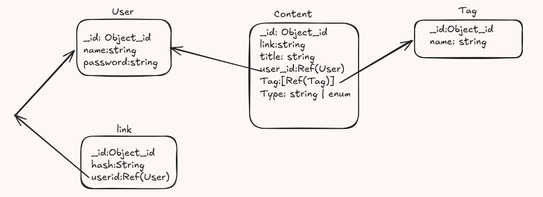

## Tables
- User
- Content
- Tag
- Link

## Design desicion
### Why content is stored seperatly from user?
- To avoid any problem in scalabilty
- To avoid large usr document result in slow searching
- TO allow efficient quering

### Why tags are in seprate table
- To keep record of all tags
- Easy to filter unique tags